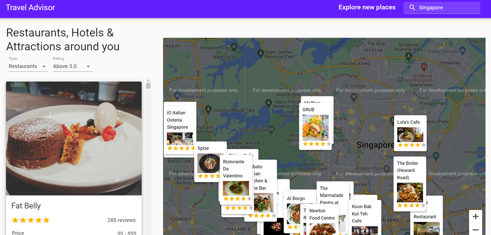
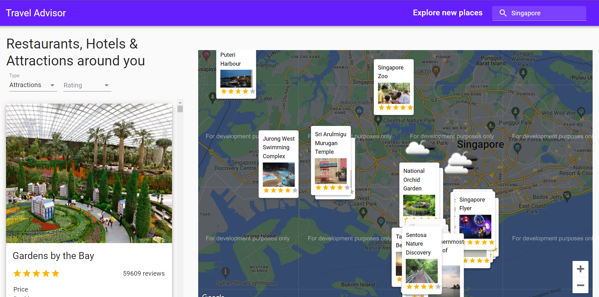
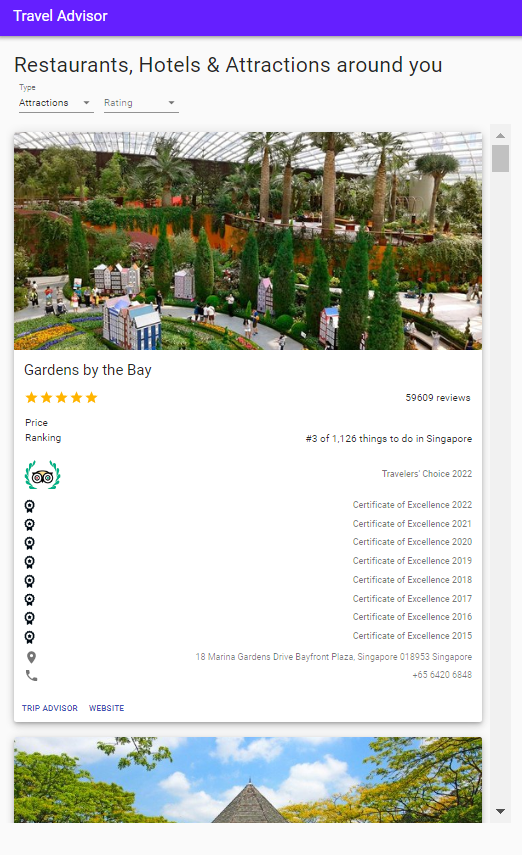
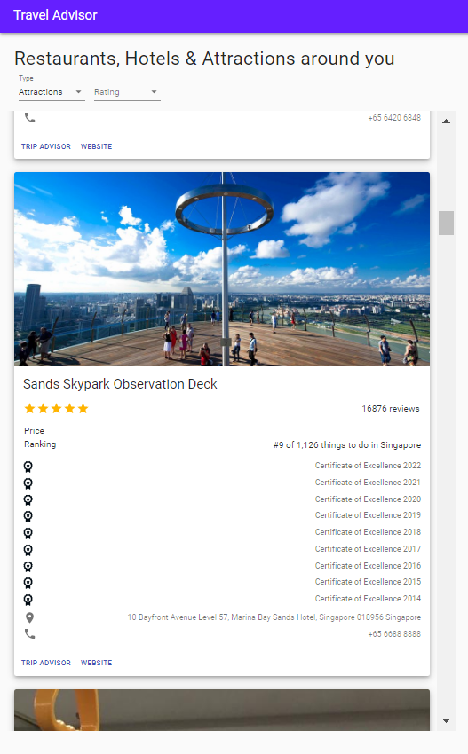

# Travel Advisor App

## Introduction
Build and Deploy an advanced Travel Companion Application using Google Maps. With Geolocation, Google Maps API, Searching for places, Fetching restaurants, hotels and attractions based on location from specialized Rapid APIs and data filtering.

This project was bootstrapped with [Create React App](https://github.com/facebook/create-react-app).

---

### Getting Started

In the project directory, you can run:

#### `npm i && npm start`

Runs the app in the development mode.\
Open [http://localhost:3000](http://localhost:3000) to view it in your browser.

The page will reload when you make changes.\
You may also see any lint errors in the console.

---

---

  
   

---

### 🌐 API
- Google Maps JavaScript API
- Google Places API
- [Travel Advisor API](https://rapidapi.com/apidojo/api/travel-advisor "Travel Advisor API")
- [Open Weather Map API](https://rapidapi.com/community/api/open-weather-map/ "Open Weather Map API")

### 🚩 [Reference](https://youtu.be/UKdQjQX1Pko "Reference")